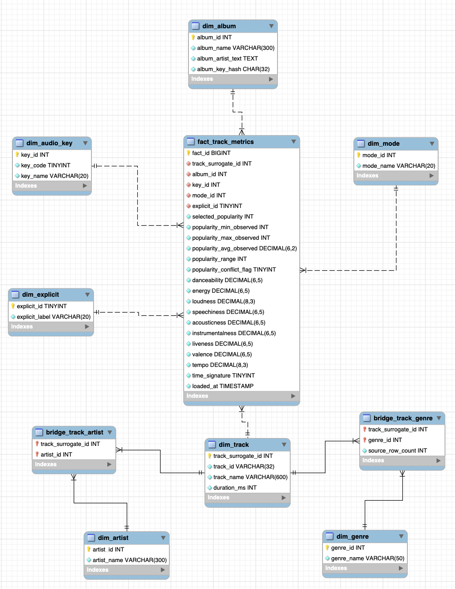

# Spotify Track Positioning Analytics

## Project objective

This project designs, implements and analyses a relational MySQL database using the Spotify Tracks Dataset. The analytical goal is to explore track positioning: which tracks, artists, albums and audio profiles appear stronger in the catalogue, and how selected genre contexts help frame these differences.

The project is built for MySQL 8.0 and MySQL Workbench.

## Data source

Original dataset:

https://www.kaggle.com/datasets/maharshipandya/-spotify-tracks-dataset

The dataset contains Spotify track metadata and audio-feature variables, including track ID, artists, album name, track name, popularity, duration, explicit flag, danceability, energy, key, loudness, mode, speechiness, acousticness, instrumentalness, liveness, valence, tempo, time signature and genre.

The source is catalogue-style track data. It is not a listening-history dataset: it does not contain user IDs, stream events, timestamps, playlist placements, countries or revenue.

The original CSV is preserved in `data/raw/spotify_tracks.csv` for source traceability. The executable raw-data import is provided in `sql/02_import_raw_data.sql`. That SQL file was generated programmatically from the CSV before packaging: the generator maps the first CSV column, exported as a blank index column, to `source_row_id`, escapes text values as SQL string literals, and writes batched `INSERT INTO raw_spotify_tracks (...) VALUES (...)` statements. The generator used for this conversion is included at `tools/generate_raw_import_sql.py` for transparency and reproducibility. During execution in MySQL Workbench, the raw table is populated directly from the generated `INSERT` statements.

## Business / analytical questions

The EDA focuses on questions that can be answered from the available data:

1. What is the final track-level popularity baseline?
2. Which tracks have the highest selected popularity overall?
3. Which artists combine high average popularity with catalogue depth?
4. Which album-credit contexts perform best?
5. Which playlist strategy buckets show higher selected popularity?
6. Which genres of interest are available in the source data?
7. Within selected genres, which attributes distinguish top-quartile tracks?
8. In selected genres, which audio attribute carries the clearest popularity signal?
9. Which genres reward typicality, and which reward distinctiveness?
10. Which selected-genre tracks look under-positioned for playlist discovery?
11. How does explicit content relate to selected popularity within selected genres?
12. Do tracks with broader genre coverage have higher selected popularity?

## Relational design

The project uses a raw staging table, dimension tables, a track-level fact table and bridge tables.

Main grain decisions:

- `raw_spotify_tracks`: one row per source row before cleaning.
- `fact_track_metrics`: one row per unique Spotify `track_id`.
- `bridge_track_genre`: one row per unique `track_id + genre` relation.
- `bridge_track_artist`: one row per unique `track_id + artist` relation.

The fact table is track-level because repeated `track_id` rows were audited. After duplicate `track_id + genre` cleanup, repeated tracks across genres did not show differences in audio attributes or metadata. Popularity varied for a small number of repeated tracks, but these conflicts were rare and mostly small relative to the full 0-100 popularity scale. Some larger conflicts contained suspicious zero values in one genre row while another row had a plausible non-zero value. Therefore, the project uses `MAX(popularity)` as the selected track-level popularity value in `fact_track_metrics.selected_popularity`, while retaining `popularity_min_observed`, `popularity_max_observed`, `popularity_avg_observed`, `popularity_range` and `popularity_conflict_flag` for auditability.

This means global popularity rankings are track-level rankings: when the EDA uses `fact_track_metrics` or `vw_track_profile`, each Spotify track appears at most once. Genre analysis still uses `bridge_track_genre`, so a track that belongs to multiple genres can contribute once to each relevant genre-level summary.

## Tables

### Raw / staging

- `raw_spotify_tracks`: source rows loaded from `sql/02_import_raw_data.sql`.

### Dimensions

- `dim_track`: track identity and duration.
- `dim_album`: album name plus artist-credit text. Album title alone is not treated as a unique album identifier.
- `dim_artist`: individual artist names split from semicolon-separated artist strings.
- `dim_genre`: Spotify genre label.
- `dim_audio_key`: musical key label.
- `dim_mode`: major/minor mode label.
- `dim_explicit`: explicit-content label.

### Fact and bridge tables

- `fact_track_metrics`: track-level popularity, popularity-audit fields and audio measurements.
- `bridge_track_genre`: many-to-many relation between tracks and genres. The one-row-per-track view `vw_track_profile` also reports `genre_count` and a display-only `genre_list`.
- `bridge_track_artist`: many-to-many relation between tracks and artists.

### Audit tables

- `etl_run_log`: row-count and ETL timestamp logging.
- `dq_quality_summary`: summary data-quality metrics.
- `dq_track_genre_duplicate_audit`: repeated `track_id + genre` checks.
- `dq_repeated_track_attribute_audit`: repeated-track attribute and popularity-variation checks across genres.
- `dq_album_name_audit`: album-name ambiguity checks.

## Data-quality treatment

The SQL project explicitly checks and documents:

- Missing descriptive values.
- Duplicated `track_id + genre` rows.
- Repeated `track_id` rows across genres.
- Whether repeated tracks differ in audio or metadata attributes.
- How much popularity varies for the same track across genre rows.
- Popularity values outside the expected 0-100 range.
- Album names associated with multiple artist-credit strings.
- Missing artist links after bridge-table creation.
- Whether tracks assigned to more genre labels differ in selected popularity.

The project uses transactions in `03_data.sql`:

- `START TRANSACTION` + `COMMIT` for cleaning missing descriptive values.
- `START TRANSACTION` + `COMMIT` for duplicate-row deletion.
- `START TRANSACTION` + `ROLLBACK` for a safety demonstration of a possible popularity range correction.

## Project structure

```text
spotify_track_positioning_mysql/
├── README.md
├── .gitignore
├── _private_presentation_notes.md
├── data/
│   └── raw/
│       ├── spotify_tracks.csv
│       └── README.md
├── docs/
│   ├── analysis_results.md
│   ├── model_diagram_placeholder.md
│   ├── model_mermaid.md
│   └── requirements_checklist.md
├── tools/
│   └── generate_raw_import_sql.py
└── sql/
    ├── 00_run_all.sql
    ├── 01_schema.sql
    ├── 02_import_raw_data.sql
    ├── 03_data.sql
    └── 04_eda.sql
```

`_private_presentation_notes.md` is ignored by Git by default.

## Execution in MySQL Workbench

Run the SQL files in this order.

### 1. Create schema and database objects

Open and run:

```text
sql/01_schema.sql
```

This creates the database, raw table, audit tables, dimensions, fact table, bridge tables, indexes, functions and views.

### 2. Load the raw source rows

Open and run:

```text
sql/02_import_raw_data.sql
```

This populates `raw_spotify_tracks` using generated SQL `INSERT` statements. At the end, it returns:

```text
raw_rows_after_insert = 114000
```

The SQL import file is already included. To regenerate it from the preserved CSV, run this from the project root before executing the SQL files:

```bash
python3 tools/generate_raw_import_sql.py
```

### 3. Clean, audit and build the dimensional model

Open and run:

```text
sql/03_data.sql
```

This validates the raw import, performs data-quality checks, removes redundant repeated source rows, audits repeated-track popularity variation, and populates the dimensions, bridge tables and fact table. The script includes an assertion that stops execution if `raw_spotify_tracks` does not contain 114,000 rows before cleaning.

### 4. Run the EDA

Open and run:

```text
sql/04_eda.sql
```

This produces the data-quality checks and the 12 analytical EDA queries.

## Model diagram

MySQL Workbench EER/model screenshot:



Image source:
```text
docs/workbench_model_diagram.png
```

A Mermaid text version of the model is provided in:

```text
docs/model_mermaid.md
```

## Main observed findings

The observed results are documented in:

```text
docs/analysis_results.md
```

Key patterns include:

- The raw source contains 114,000 rows.
- Redundant duplicate `track_id + genre` rows are detected and removed.
- Repeated tracks across genres do not differ in audio attributes or metadata after duplicate cleanup.
- Popularity differences across repeated tracks are rare and usually small relative to the 0-100 scale.
- Selected popularity is defined as the maximum observed popularity for each track, so global popularity rankings are not duplicated by genre relations.
- Shoegaze is not available as a source genre label.
- Within selected genres, audio-feature correlations with selected popularity are exploratory and moderate rather than deterministic.
- Genre typicality has different relationships with popularity depending on genre: in some genres more typical tracks are more popular, while in others more distinctive tracks perform better.
- Tracks with two or three genre labels have higher average selected popularity than tracks with only one genre label, but very high genre counts are rare and should not be over-interpreted.

## Limitations

The project should not be interpreted as a causal model of music success. Popularity is an observed dataset variable, not a stream count or time-series outcome. The source data do not include release dates, listener demographics, countries, playlist placements, marketing spend or historical changes in popularity.
