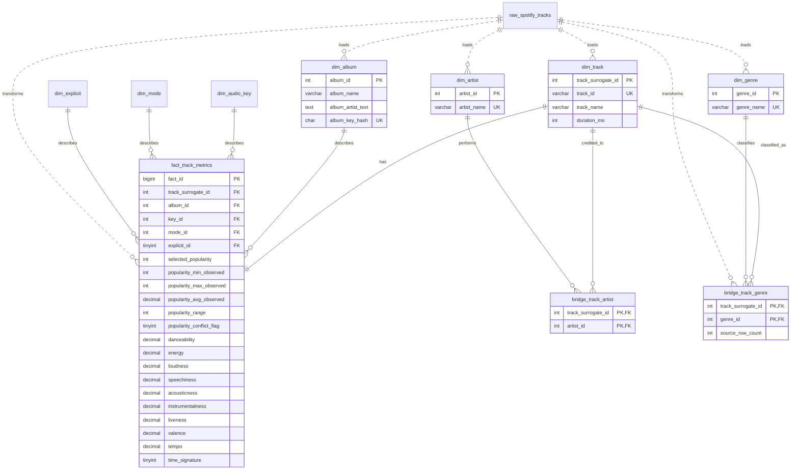

# Model diagram in Mermaid format

```mermaid
erDiagram
    dim_track ||--|| fact_track_metrics : has
    dim_album ||--o{ fact_track_metrics : describes
    dim_audio_key ||--o{ fact_track_metrics : describes
    dim_mode ||--o{ fact_track_metrics : describes
    dim_explicit ||--o{ fact_track_metrics : describes

    dim_track ||--o{ bridge_track_genre : classified_as
    dim_genre ||--o{ bridge_track_genre : classifies

    dim_track ||--o{ bridge_track_artist : credited_to
    dim_artist ||--o{ bridge_track_artist : performs

    raw_spotify_tracks ||..o{ dim_track : loads
    raw_spotify_tracks ||..o{ dim_album : loads
    raw_spotify_tracks ||..o{ dim_artist : loads
    raw_spotify_tracks ||..o{ dim_genre : loads
    raw_spotify_tracks ||..o{ fact_track_metrics : transforms
    raw_spotify_tracks ||..o{ bridge_track_genre : transforms

    dim_track {
        int track_surrogate_id PK
        varchar track_id UK
        varchar track_name
        int duration_ms
    }

    dim_album {
        int album_id PK
        varchar album_name
        text album_artist_text
        char album_key_hash UK
    }

    dim_artist {
        int artist_id PK
        varchar artist_name UK
    }

    dim_genre {
        int genre_id PK
        varchar genre_name UK
    }

    fact_track_metrics {
        bigint fact_id PK
        int track_surrogate_id FK
        int album_id FK
        int key_id FK
        int mode_id FK
        tinyint explicit_id FK
        int selected_popularity
        int popularity_min_observed
        int popularity_max_observed
        decimal popularity_avg_observed
        int popularity_range
        tinyint popularity_conflict_flag
        decimal danceability
        decimal energy
        decimal loudness
        decimal speechiness
        decimal acousticness
        decimal instrumentalness
        decimal liveness
        decimal valence
        decimal tempo
        tinyint time_signature
    }

    bridge_track_genre {
        int track_surrogate_id PK, FK
        int genre_id PK, FK
        int source_row_count
    }

    bridge_track_artist {
        int track_surrogate_id PK, FK
        int artist_id PK, FK
    }
```

MySQL Workbench EER diagram screenshot from 

`docs/workbench_model_diagram.png`

